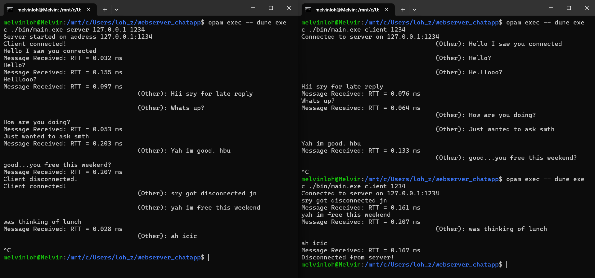

## One-on-One Chat Application

A simple one-on-one chat application built in OCaml that allows communication between a server and client. The application provides two modes - server and client.

The specification are as follows:
```
    1) Server and client modes.
    2) Acknowledgment for received messages.
    3) Roundtrip time shown for message acknowledgment.
    4) The ability to handle messages without making assumptions about content (e.g., encoding).
    5) Simple console-based UI for communication.
```

Once the server and client are running and connected, you can send messages from one side. Each message sent will be acknowledged by the receiver, and the round-trip time (RTT) will be displayed on the sending side.

The client can terminate the connection by closing the client application.
Once the client disconnects, the server continues running and waits for another client to connect.

### Prerequisites

**Envrionment:** Ubuntu 22.04.2 LTS. Install `ocaml 5.3.0`, `opam 2.1.2` and `dune 3.17.2`. Then run 
```
opam exec --dune install
opam exec --dune build
```
to build project and install dependencies. Project uses `uutf 1.0.3`, `lwt 5.9.0` and `ounit2 2.2.7`. 

### Running the App

To run app from project root directory:
```
Usage: main.exe <mode> <addr> <port>
- mode: server OR client
- addr (optional - default: loopback address): IPv4 address
- port: port number

opam exec -- dune exec ./bin/main.exe server 127.0.0.1 1234
opam exec -- dune exec ./bin/main.exe client 127.0.0.1 1234
```
A sample usage of the app is shown below:


### Test scripts

To run unit tests
```
opam exec -- dune runtest
```
After running the unit tests, you should see the sample output

```
path/to/webserver_chatapp$ opam exec -- dune runtest
..                                 
Ran: 2 tests in: 0.12 seconds.
OK
```
